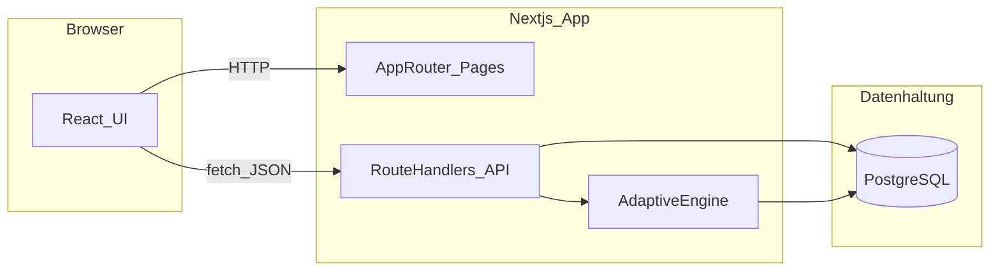
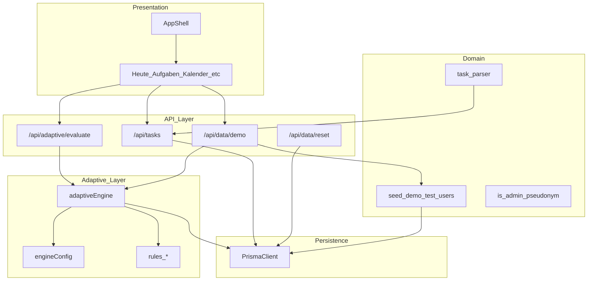
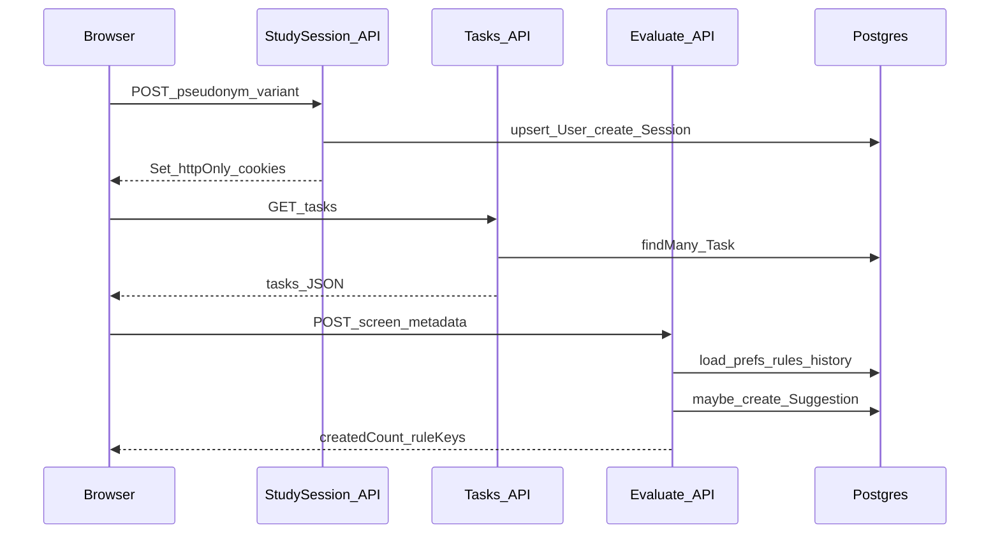

# FluxPlan – Anleitung, Technologie, Architektur & Projektgeschichte

Dieses Dokument hat **drei** Hauptteile:

1. **Anleitung** – was die Anwendung kann und wie du jede Funktion ausprobieren kannst.
2. **Technologie** – was hinter den Kulissen passiert, einfach erklärt. Ziel: Du kannst jeden Punkt im Code zeigen und in 1–2 Sätzen erklären.
3. **Architektur & Projektentwicklung** – geplante vs. umgesetzte Architekturentscheidungen, Systemdiagramme (Mermaid) und eine **Chronik** von Feedback und Änderungen im Projektverlauf (für Bachelorarbeit/Abwehr im Verteidigungsgespräch).

**Kompakter UI-Katalog** (Features, Trigger, sichtbare UI-Effekte, Baseline vs. Adaptive — für Leitung/Runner): [`UI-FEATURES-KATALOG.md`](UI-FEATURES-KATALOG.md).  
Study Sheets für Probanden + Runner-Hinweise: [`study-sheets/README.md`](study-sheets/README.md).

---

# Teil 1 · Anleitung

## 1.1 Erste Schritte

1. App starten (Docker Compose):

   ```bash
   docker compose up -d --build
   ```

   Dabei startet auch der Service **`e2e`** und führt die **Playwright-Suite** einmal aus (nachdem `app` „healthy“ ist). Mit `-d` siehst du die Testausgabe nicht im Terminal — nachverfolgen mit `docker compose logs -f e2e`. Ergebnis-Exitcode: `docker wait "$(docker compose ps -q e2e)"` (kurz nach Ende des Laufs). Nur Tests wiederholen: `docker compose run --rm e2e`.

   Browser öffnen: `http://localhost:3000`.

2. Beim Öffnen der App: **`/` → `/start`**. **„Start“** in der Sidebar führt zur **gespeicherten Standardansicht** (z. B. `/heute`, `/kalender`, `/aufgaben`, `/erstellen` — aus der Preference `startView`; ohne Session oder ohne abgeschlossenes Willkommen → **`/willkommen`**). **„Willkommen“** ist eine **eigene** Seite mit Tour & Prinzipien (`/willkommen`). Über `/einstellungen → Pseudonym & Session` legst du einen frei wählbaren Code an (z. B. `P01`). Erst danach werden Aufgaben und Logs unter diesem Pseudonym gespeichert.

3. Über die Sidebar wechselst du zwischen den Hauptbereichen. Auf Mobile gibt es die untere Tab-Bar.

## 1.2 Aufgaben verwalten

| Aktion | Wo |
| --- | --- |
| Anlegen (klassisch) | `/aufgaben` → Knopf „Neue Aufgabe" |
| Anlegen (mit Sprache) | `/erstellen` |
| Schnell anlegen | `/heute` → Eingabezeile unter der To‑Do‑Liste |
| Bearbeiten | Stift-Icon an jeder Aufgabe (Dialog mit **denselben** Zusatzfeldern wie auf `/erstellen`: Kategorie, Tags, Dauer, Erinnerung, Beschreibung — per Chips aktivierbar) |
| Erledigen | Häkchen anklicken |
| Löschen | Mülleimer-Icon |
| Suchen / Filtern | `/aufgaben` (Suche oben, Quick-Chips: Heute, Überfällig, Diese Woche, Ohne Datum) |
| Sortieren | Dropdown rechts neben den Filtern |

### Sprachparser (`/erstellen`)

Du tippst frei deutsch und FluxPlan extrahiert daraus Datum, Zeit, Priorität, Tags und Dauer. Beispiele: 

- `morgen 9:30 für Studium 60 min` → Datum + Zeit + Liste + Dauer
- `Fr 12.5. !hoch #recherche` → Datum + Priorität + Tag
- `heute 14 uhr` → Datum + Zeit

Die geparsten Werte erscheinen als Chips. Du kannst sie jederzeit überschreiben oder zusätzliche Felder per Klick öffnen.

**Eingeklappte Zusatzfelder:** Wenn die Präferenz **„Zusatzfelder eingeklappt“** aktiv ist (`taskFormOptionalFold`, siehe Einstellungen oder adaptiver Vorschlag „Zusatzfelder zunächst ausblenden?“), siehst du zuerst nur Titel, Datum, Uhrzeit und Priorität. Über **„Weitere Felder einblenden“** erscheinen die Chip-Leiste und die optionalen Eingaben wieder; der Parser klappt bei Bedarf automatisch auf (z. B. wenn `#Tags` erkannt werden).

## 1.3 Heute-Dashboard (`/heute`)

- **To‑Do‑Liste**: Für heute zusammengestellte Aufgaben (überfällig, heute fällig, Priorität, dann Auffüller).
- **Heute im Überblick**: Termine mit Uhrzeit als Mini-Agenda.
- **Schnellzugriff**: Liste der Tastatur-Shortcuts (siehe 1.13).
- **Woche im Überblick**: Mini-Monatskalender mit Tagen, an denen Aufgaben fällig sind.
- **Status**: Modus + Vorschlags-/Undo-Info (praktische Hinweise, keine „Deko“-Badges).

## 1.4 Kalender (`/kalender`)

- Wochenraster mit Stundenslots (8–19 Uhr).
- Jede Aufgabe mit Datum erscheint als Chip am richtigen Tag.
- **Konflikte** (mehrere Aufgaben gleichzeitig oder >8 h Gesamtschätzung) werden rot markiert. FluxPlan verschiebt nichts automatisch.
- Rechte Spalte: ungeplante Aufgaben (kein Datum) und freie Slots-Vorschau.
- Wochen-Navigation oben (Pfeile + Heute-Knopf).

## 1.5 Adaptive Vorschläge (`/anpassungen`)

Drei Tabs:

### Tab „Anpassungen"

- **Aktive Vorschläge** links, Detailpanel rechts.
- Pro Vorschlag: Titel, Erklärung, „Was passiert beim Annehmen", Buttons **Annehmen / Nicht jetzt / Ablehnen**.
- **„Warum sehe ich das?"** öffnet die ausführliche Erklärung.
- **Verlauf** zeigt vergangene Entscheidungen. Bei `accepted` gibt es **Rückgängig** (soweit im Backend für den jeweiligen `type` umgesetzt).
- **Visuelle Unterscheidung:** Jede Regel hat ein **eigenes Icon**, einen **farbigen linken Akzent** und ein **Kategorie-Badge** (z. B. „Überblick“ für Fokus, „Formular“ für Chip-Vorschläge, „Kompakt“ für Einklappen). Im Detail gibt es eine **Strapline** (ein Satz zur Art des Vorschlags), damit ähnlich klingende Texte („nichts passiert automatisch“ vs. „nur Hinweis“) nicht dasselbe „Look & Feel“ vortäuschen.

### Tab „Personalisierung"

- Schalter pro Heuristik (Regel ein/aus).
- **Eingriffsstufe** 0–3 (skaliert die Schwellen aller Regeln).
- **Probelauf**: Knopf „Heuristiken jetzt prüfen" — ruft die Engine sofort auf, ohne auf Aktionen zu warten.
- Transparenz-Statistiken (gesamt / angenommen / abgelehnt / vertagt).

### Tab „Cooldown"

- Listet Regeln, die wegen 2× Ablehnung 14 Tage pausiert sind.
- Zeigt zuletzt abgelehnte Vorschläge.

### Transparenz-Panel oben

Zeigt vor allen Tabs, welche Zahlen aus den letzten 7 Tagen in die Engine fließen (Anzahl Aufgaben, % mit Datum, % mit Erinnerung). Garantiert: **es geht nichts darüber hinaus** in die Engine.

## 1.6 Heuristiken im Test

Jede Regel reagiert auf einfache Muster. Die Engine läuft u. a. nach **Navigation** (`view_changed` → `POST /api/adaptive/evaluate`), beim **Öffnen von `/heute`**, und nach **`POST /api/tasks`** (Create) mit `screen: "task_created"`. So kannst du Regeln gezielt auslösen:

| Regel (`ruleKey`) | Suggestion-`type` (typisch) | Auslöser (vereinfacht) | Wirkung bei **Annehmen** |
| --- | --- | --- | --- |
| `view_preference` | `start_view` | Häufig zwischen zwei Ansichten wechseln (z. B. `/heute` ↔ `/kalender`; Details in Regelcode) | Startansicht (`startView`) speichern; optional Navigation |
| `reminder_preference` | `reminder_suggestion` | Wiederholt ähnliche Aufgaben mit Erinnerung (siehe Regel) | `reminderAt` auf betroffener Aufgabe setzen |
| `daily_focus` | `daily_focus` | Viele offene/heutige Aufgaben (Schwelle in Regel) | **Keine** Datenänderung — nur Transparenz / Zustimmung |
| `calendar_conflict` | `calendar_conflict` | Neue Aufgabe; an einem Kalendertag sehr hohe Summe geschätzter Minuten | **Keine** automatische Verschiebung — Hinweis |
| `adaptive_task_creation` | `task_form_chips` | Nach mehreren neuen Aufgaben: hoher Anteil mit Fälligkeit **und** Erinnerung (Schwellen abhängig von Eingriffsstufe) | Kein Pflicht-Feld im Formular; dokumentiert Zustimmung zum Konzept der Vorschlags-Chips |
| `adaptive_optional_fold` | `task_form_optional_fold` | Nach mehreren Aufgaben: **geringer** Anteil mit Kategorie/Tags/Dauer/Erinnerung/Beschreibung; kein offener `task_form_chips`-Vorschlag | Präferenz `taskFormOptionalFold` = eingeklappte Zusatzfelder beim Anlegen/Bearbeiten |

**Hinweise:**

- `adaptive_task_creation` und `adaptive_optional_fold` schließen sich inhaltlich aus, solange ein **Chip-Vorschlag** noch pending ist (Fold-Regel wartet dann).
- Schwellen skalieren mit **Eingriffsstufe** und ggf. `DEMO_MODE` / `FP_*` Umgebungsvariablen (kürzere Snooze/Cooldown in Demos).

Alternativ: Tab Personalisierung → **Heuristiken jetzt prüfen** (ruft die Engine mit gewähltem Screen auf).

## 1.7 Baseline vs. Adaptive (was ist anders?)

Die **Studienvariante** steckt in der Session (`baseline` vs. `adaptive`). Technisch nutzt dieselbe App **dieselbe Codebasis**; Unterschied ist **ob und wie** Vorschläge erzeugt und gezeigt werden.

| Aspekt | Baseline | Adaptive |
| --- | --- | --- |
| **Neue Vorschläge** | Engine wird faktisch nicht genutzt bzw. Demo setzt `adaptive.enabled` oft auf `false` | `adaptive.enabled` true → Regeln dürfen pending Vorschläge anlegen |
| **Banner auf `/heute`** | wird nicht geladen / nicht angezeigt | kann einen pending Vorschlag zeigen (Priorität u. a. `daily_focus`, `view_preference`) |
| **`/anpassungen`** | Tabs nutzbar; **keine** frischen Trigger aus dem laufenden Alltag | aktive Vorschläge + Verlauf; Karten optisch nach Regelart getrennt |
| **Kalender-Konflikte** | **Ja** — reine UI-Heuristik (Überlappung, Kapazität) | **Ja** — identisch; zusätzlich kann die Engine einen **Konflikt-Hinweis-Vorschlag** erzeugen |
| **Formular `/erstellen` + Bearbeiten** | Volle manuelle Bedienung; **Einstellung** „Zusatzfelder eingeklappt“ wirkt trotzdem, wenn gesetzt | wie Baseline **plus** optionale Vorschläge (`task_form_chips`, `task_form_optional_fold`) |
| **Logging** | gleiche Events möglich; weniger `suggestion_*` / `engine_evaluated` in der Praxis | mehr Einträge, sobald Proband mit Vorschlägen interagiert |

**Kernaussage für die Arbeit:** Baseline liefert die **ruhige Produktivitäts-UI** ohne adaptive Schicht; Adaptive fügt **erklärbare, reversible Vorschläge** hinzu — ohne automatisches Umplanen.

## 1.8 Einstellungen: Formular „Zusatzfelder“

Unter `/einstellungen` gibt es die Karte **„Aufgabe anlegen: Zusatzfelder“** (Schalter). Sie speichert `taskFormOptionalFold` (`{ enabled: true|false }`) und wirkt auf **`/erstellen`** und den **Bearbeiten-Dialog** — unabhängig davon, ob die Session baseline oder adaptive ist. So können Probanden in der Baseline ebenfalls ein kompakteres Formular wählen, ohne dass die Engine beteiligt sein muss.

## 1.9 Theme (Hell / Dunkel / System)

- Sidebar oben rechts: kleiner Sonne/Mond-Knopf für schnellen Wechsel.
- `/einstellungen → Darstellung`: drei Buttons **Hell**, **Dunkel**, **System**.
- Standard ist **Hell**. Auswahl wird nur im Browser (`localStorage`) gespeichert, beeinflusst keine Studiendaten.

## 1.10 Studienmodus, Pseudonym, Export, Reset

- **Pseudonym**: `/einstellungen → Pseudonym & Session`. Frei wählbar, keine Klarnamen.
- **Session-Code** (optional): zur Trennung mehrerer Test-Durchläufe pro Pseudonym.
- **Export**: `/einstellungen → Export JSON` oder `Export CSV` (oder direkt `GET /api/export?format=json|csv`).
- **Reset**: roter Knopf „Daten zurücksetzen" + Bestätigungsdialog. Löscht Aufgaben, Vorschläge, Logs und Präferenzen für das Pseudonym. Pseudonym selbst bleibt.

## 1.11 Demo-Setup, Rollen & Study Sheets (druckfertig)

FluxPlan hat einen integrierten Demo-Mechanismus, damit Testpersonen **ohne lange Eingabe** direkt sinnvolle Daten bekommen.

### Rollen (Stories)

- **Familienplanner**: kalendernah, Termine/Erinnerungen, Konflikte im Wochenraster, häufiger Wechsel zwischen Heute und Kalender.
- **Taskplanner**: aufgabengetrieben, Kategorien/Tags, Suche/Filter, Quick-Add und Sprachparser.
- **Eval-Runner**: reproduzierbarer Feature-Check (Vorschläge, Konflikte, Export/Reset).

### Demo-Button (UI)

1. Study Session starten (z. B. Pseudonym `F01` / `T01` / `E01`).
2. `/einstellungen` → Karte **„Demo-Setup“** → Rolle auswählen → **„Demo-Daten laden“**.

Das lädt ein **größeres Aufgaben-Set** passend zur Rolle (inkl. Konflikt- und Trigger-Daten) und führt direkt danach eine Heuristik-Prüfung aus.

### Demo-Endpoint (API)

- `POST /api/data/demo`
  - macht standardmäßig: **Reset → Aufgaben-Set + View-Events + Preferences → mehrere Engine-Evaluations → final evaluate auf `/heute`**
  - optionaler Body:

    ```json
    { "role": "familienplanner" | "taskplanner" | "evalrunner", "resetFirst": true }
    ```

### Study Sheets (zum Ausdrucken)

Die druckfertigen Aufgabenblätter liegen unter:

- `docs/study-sheets/familienplanner.md`
- `docs/study-sheets/taskplanner.md`
- `docs/study-sheets/evalrunner.md`

Jedes Sheet enthält:
- ein vollständiges Aufgaben-Set (damit die Person nicht erst Daten eintippen muss)
- einen kurzen Ablauf (8–15 Minuten), um Features gezielt zu triggern

### Seed-Testuser (10–15 Pseudonyme)

Für schnelle Tests erzeugt das Prisma-Seed aktuell 15 Pseudonyme:

- `F01–F05` (Familienplanner)
- `T01–T05` (Taskplanner)
- `E01–E05` (Eval-Runner)

Hinweis: Im Seed werden Aufgaben mit Prefix gespeichert (z. B. `F01: ...`), damit sie sich nicht gegenseitig überschreiben.

### Während des Testens zurücksetzen (empfohlener Ablauf)

**Nur der aktuell eingeloggte Pseudonym-User** (dein Browser nach „Session starten“):

- `/einstellungen → Daten zurücksetzen` — löscht Aufgaben, Interaktionen, Vorschläge und Präferenzen; **Pseudonym bleibt**.
- Oder erneut **„Demo-Daten laden“** — macht intern ebenfalls einen Reset und legt die 10 Rollen-Aufgaben plus Trigger-Daten neu an (schneller Weg „frischer Zustand“).

**Alle 15 Seed-Testuser auf einmal** (wenn mehrere Personen an `F01`–`E05` getestet haben und die DB wieder sauber sein soll):

1. Im Ordner `fluxplan/` mit gültiger `DATABASE_URL` (wie bei Prisma):
   ```bash
   npm run reset:test-users
   npm run prisma:seed
   ```
2. `reset:test-users` **löscht die User** `F01`–`F05`, `T01`–`T05`, `E01`–`E05` inkl. aller zugehörigen Daten (Cascade). `prisma:seed` legt sie mit den Standard-10-Aufgaben pro Rolle neu an.

Liste der Pseudonyme im Code: `src/lib/demo/test-pseudonyms.ts`.

### Admin in der Oberfläche (alle Demo-Testuser zurücksetzen)

Für die Studie brauchst du manchmal **kein Terminal**: ein **Admin-Pseudonym** sieht in `/einstellungen` eine gelbe Karte **„Admin: Demo-Testuser“**.

1. In `.env` bzw. Docker (`docker-compose.yml`) setzen: `FLUXPLAN_ADMIN_PSEUDONYMS` — Standard ist **`admin`** (ein Eintrag reicht; mehrere möglich, kommagetrennt). Der Vergleich ist **case-insensitive** (`Admin` und `ADMIN` sind dasselbe).
2. App neu starten (damit die Variable geladen wird).
3. Unter `/einstellungen → Pseudonym & Session` als Pseudonym z. B. **`admin`** eintragen und **Session starten**.
4. Karte **„Alle Demo-Testuser zurücksetzen“** öffnen und `RESET_DEMO_USERS` eintippen.

Das löscht nur `F01`–`F05`, `T01`–`T05`, `E01`–`E05` und legt sie wie beim Seed neu an. **Dein Admin-Konto bleibt.**

Backend: `POST /api/data/reset-demo-users` mit Body `{ "confirm": "RESET_DEMO_USERS" }` (nur wenn eingeloggt und Admin-Pseudonym).

### Session beenden (Abmelden / User wechseln)

- In `/einstellungen` gibt es den Button **„Session beenden“** (oben in der Session-Karte und bei „Study Session“). Er löscht die httpOnly-Cookies — du bist dann **kein eingeloggter User** mehr.
- Danach kannst du ein anderes Pseudonym starten (z. B. wieder `admin` oder `F01`).
- **Ohne Session** liefern viele Seiten leere Daten oder keine persönlichen Aufgaben (API antwortet mit 401). Zum Arbeiten mit Daten immer zuerst eine Session starten.

Technisch: `POST /api/study/logout`.

## 1.12 Logging im Hintergrund (transparent)

Alle wichtigen Interaktionen werden mitgeschrieben (in `TaskInteraction` oder `EventLog`):

- Navigation (`view_changed`)
- Aufgaben-CRUD (`task_created`, `task_completed`, `task_undone`, `task_deleted`)
- Filter & UI (`filter_used`, `reminder_added`)
- Vorschläge (`suggestion_seen`, `suggestion_accepted/rejected/snoozed/undone`, `why_clicked`)
- Engine (`engine_evaluated`, `rule_toggled`, `rule_cooldown_started`, `preference_changed`)
- System (`data_reset`, `seed_initialized`)

Der Export liefert genau diese Tabellen — kein zusätzliches Tracking, kein externer Service.

## 1.13 Tastatur-Shortcuts

| Taste | Wirkung |
| --- | --- |
| `h` | Zu **Heute** |
| `a` | Zu **Aufgaben** |
| `k` | Zu **Kalender** |
| `n` | Zu **Erstellen** (Neue Aufgabe) |
| `e` | Zu **Einstellungen** |

Shortcuts sind in Eingabefeldern automatisch deaktiviert (du kannst also normal tippen). Mod-Tasten (Ctrl/Alt/Cmd) werden ignoriert.

---

# Teil 2 · Technologie (Bachelor-Niveau)

## 2.1 Was ist Next.js?

Ein React-Framework. Es bietet:

- **Routing über Dateien**: jede `page.tsx` in `src/app/<pfad>/` wird automatisch zur Route. Beispiel: `src/app/(app)/heute/page.tsx` ⇒ URL `/heute`.
- **Server-Komponenten und Client-Komponenten**: Standardmäßig läuft eine Komponente auf dem Server. Mit der Direktive `"use client"` oben in der Datei läuft sie im Browser. Wir nutzen Client-Komponenten überall dort, wo `useState`, `useEffect` oder Eventhandler nötig sind.
- **API-Routes**: jede `route.ts` in `src/app/api/...` ist ein Backend-Endpunkt. Statt eines extra Express-Servers schreiben wir `export async function GET()` oder `POST()` direkt in die Datei.

### Route Groups

Ordnernamen mit runden Klammern wie `(app)` erscheinen **nicht** in der URL. Wir nutzen `src/app/(app)/...`, damit alle Hauptseiten ein gemeinsames Layout (`layout.tsx` in `(app)`) bekommen, ohne dass `/app` Teil der URL wird.

### App Router (App Directory)

Alles spielt sich in `src/app/` ab. `layout.tsx` umschließt jede Seite. `page.tsx` ist der Inhalt einer Route. `route.ts` ist ein API-Endpunkt.

## 2.2 React 19 + TypeScript

- **Komponenten** sind Funktionen, die JSX zurückgeben. Beispiel: `function FocusListCard() { return <Card>…</Card>; }`.
- **Hooks** sind Funktionen, die mit `use…` beginnen. Wir nutzen vor allem:
  - `useState` für lokalen Zustand
  - `useEffect` für Seiteneffekte (Daten laden beim Mount, Event-Listener)
  - `useMemo` / `useCallback` für stabile Werte zwischen Renders
- **TypeScript** ergänzt JavaScript um Typen (`string`, `number`, `User`, …). Vorteil: viele Fehler werden schon beim Tippen sichtbar, ohne den Code zu starten.

## 2.3 Tailwind CSS v4 + shadcn/ui

- **Tailwind** ist eine Sammlung kleiner CSS-Hilfsklassen wie `flex`, `gap-2`, `text-muted-foreground`. Statt CSS-Dateien zu pflegen, schreiben wir Klassen direkt in JSX. Vorteil: konsistentes Design, kaum „toter" CSS-Code.
- **shadcn/ui** ist *kein* npm-Paket im klassischen Sinn. Es ist ein Sammlung kopierbarer React-Komponenten (Button, Card, Dialog, Switch, …), die wir lokal in `src/components/ui/` haben. Wir können sie frei anpassen.
- **CSS-Variablen für Themes**: Farben sind in `src/app/globals.css` als Variablen (`--primary`, `--background`, …) definiert — einmal für Hellmodus (`:root`) und einmal für Dunkelmodus (`.dark`). Tailwind/shadcn liest die Variablen, also ändert ein Klassenwechsel an `<html>` automatisch alle Farben.

### Theme-Wechsel mit `next-themes`

Die Library setzt nur die Klasse `.dark` (oder entfernt sie) auf das `<html>`-Element. Der Rest passiert automatisch via CSS-Variablen. Unser Toggle (`src/components/shell/theme-toggle.tsx`) ruft im Wesentlichen `setTheme("dark")` oder `setTheme("light")` auf.

## 2.4 Prisma + PostgreSQL

- **PostgreSQL** ist die Datenbank. Sie läuft als eigener Docker-Container (`db`).
- **Prisma** ist der ORM (Object-Relational Mapper). Er hat drei Bestandteile:
  1. `prisma/schema.prisma` — die Definition aller Tabellen (`Task`, `User`, `AdaptiveSuggestion`, …).
  2. `prisma migrate` — verwandelt das Schema in echte SQL-Migrations und führt sie auf der DB aus.
  3. `@prisma/client` — der TypeScript-Client. Damit schreiben wir z. B. `prisma.task.findMany({ where: { userId } })` ohne SQL.
- **Seed**: `prisma/seed.ts` füllt die DB mit Beispiel-Daten (User, Aufgaben, Vorschläge). Beim ersten Start im Container wird das automatisch ausgeführt.
  - Zusätzlich werden 10–15 Test-Pseudonyme (`Fxx`, `Txx`, `Exx`) mit je einem Aufgaben-Set angelegt, um Features schnell prüfen zu können.

## 2.5 Auth: HTTP-only Cookies, kein OAuth

Wir setzen beim ersten Pseudonym-Login zwei Cookies (`fp_user_id` und `fp_session_id`). Sie sind **httpOnly**, also vom JS im Browser nicht lesbar — nur das Backend kann sie auswerten. Das ist sicher genug für einen Studien-Prototyp und braucht keine externen Auth-Provider.

Hilfsfunktion: `requireUserId()` in `src/lib/auth/require-user.ts` wirft `HttpError(401)` wenn kein User-Cookie da ist. So müssen API-Routes nichts mehr selbst prüfen.

## 2.6 Validation mit Zod

In jeder API-Route, die einen Body nimmt, definieren wir ein `Zod`-Schema (z. B. `z.object({ title: z.string().min(1) })`). Wir parsen dann den Body damit. Vorteile: keine ungültigen Daten gelangen in die DB, die Fehlermeldung ist klar, und TypeScript bekommt automatisch den passenden Typ.

## 2.7 Docker & Docker Compose

- **Dockerfile** beschreibt, wie das App-Image gebaut wird (auf Basis Node 22, Dependencies installieren, Code kopieren, Startbefehl).
- **docker-compose.yml** orchestriert mehrere Container:
  - `db` (Postgres 16) mit Healthcheck und persistentem Volume.
  - `app` (unsere Next-App) mit Mount des Projektverzeichnisses (`.:/app`), so dass Hot-Reload greift.
  - Beim Start ruft die App das Skript `scripts/docker-start-dev.mjs` auf, das `prisma generate`, `migrate deploy` und `seed` ausführt, bevor `next dev` startet.
- **Hot-Reload**: weil das Projekt als Volume eingebunden ist, sieht der Container sofort jede Änderung an `.tsx`/`.ts`-Dateien. Du musst meistens nur den Browser refreshen.

## 2.8 Adaptive Engine — die wichtigste Stelle der Arbeit

In `src/lib/adaptive/`:

- `adaptiveEngine.ts` — die Hauptschleife. Sie läuft pro Aufruf einmal alle Regeln durch und legt einen Vorschlag an, wenn die Regel zustimmt und es noch keinen offenen gleichen gibt.
- `engineConfig.ts` — lädt aus `UserPreference`:
  - `adaptive.enabled` (Master-Toggle)
  - `adaptive.interventionLevel` (0–3, skaliert Schwellen)
  - `adaptive.cooldown.<ruleKey>` (Pausen nach Ablehnungen)
  - aktuelle 24-h-Snoozes aus den Suggestions
- `rules/` — **sechs** eigenständige Dateien (eine pro Heuristik): u. a. `adaptiveTaskCreationRule.ts`, `adaptiveOptionalFoldRule.ts`. Jede exportiert ein `AdaptiveRule`-Objekt mit `key`, `name`, `description` und `evaluate(ctx)` → `SuggestionDraft` oder `null`.

### Beispiel-Lebenszyklus eines Vorschlags

1. Du klickst eine Aufgabe an.
2. Die App ruft `POST /api/adaptive/evaluate`.
3. `runAdaptiveEngine` lädt die Engine-Konfiguration und durchläuft alle Regeln.
4. Trifft `dailyFocusRule` zu (≥ 4 heutige Aufgaben), erzeugt sie einen Draft.
5. Ist die Regel nicht pausiert (kein Cooldown, kein Snooze, Master-Toggle aktiv) und gibt es noch keinen offenen gleichen Vorschlag → eintragen in `AdaptiveSuggestion`.
6. Du siehst ihn auf `/anpassungen`. Klick auf „Annehmen" ruft `POST /api/suggestions/:id/respond` mit Action `accept` auf — der Vorschlag wird umgesetzt (z. B. Erinnerung eintragen).
7. Klick auf „Ablehnen" zählt als Reject. Zwei Rejects in 14 Tagen ⇒ Cooldown (Regel 14 Tage pausiert).

### Warum so einfach?

Bewusst — die Bachelor-Arbeit will **erklärbare** Adaptivität. Jede Regel ist ein TypeScript-File mit ein paar Datenbank-Queries und einer Bedingung. Du kannst jede in 30 Sekunden lesen.

## 2.9 Logging-Modelle

- `TaskInteraction` — alles, was direkt mit Aufgaben oder Engine-Ereignissen zu tun hat (`task_created`, `engine_evaluated`, …).
- `EventLog` — eher UI- und Studien-Ereignisse (`view_changed`, `suggestion_seen`, `filter_used`, …).

Beide Tabellen haben Felder für `userId`, `type`/`eventType`, `metadata` (JSON) und `createdAt`. Der Export liefert beide direkt aus.

## 2.10 Wo finde ich was?

```
src/
  app/                    # Routen (UI + API)
    (app)/                # Hauptseiten mit gemeinsamem AppShell
      heute/              # Today-Dashboard
      aufgaben/           # Aufgabenliste
      kalender/           # Wochen-Kalender
      erstellen/          # Progressives Formular
      anpassungen/        # Adaptive Vorschläge (3 Tabs)
      einstellungen/      # Pseudonym, Theme, Master-Toggle, Reset
    api/                  # Route Handlers (Backend)
  components/
    shell/                # AppShell, Sidebar, ThemeToggle, PageHeader
    tasks/                # TaskCard, ProgressiveTaskForm, TasksScreen
    planning/             # TodayDashboard, WeekPlanner, MiniMonthCalendar
    adaptive/             # SuggestionsScreen + Tab-Komponenten
    settings/             # PreferencesForm, AppearanceCard, DataResetButton
    study/                # SessionCodeInput, StudySessionBanner
    ui/                   # shadcn-Bausteine (Button, Card, …)
  lib/
    db/prisma.ts          # Prisma Singleton
    auth/                 # Cookie- und User-Helper
    adaptive/             # Engine + Regeln + EngineConfig
    demo/                 # Rollen-Definitionen für Demo/Seed (je Rolle Aufgaben-Set)
    parser/               # Sprachparser für /erstellen
    hooks/                # useKeyboardShortcuts
    ui/                   # Kategorie-Helper
prisma/
  schema.prisma           # Datenmodell
  seed.ts                 # Beispiel-Daten
  migrations/             # SQL-Migrations
docs/
  DOKUMENTATION.md        # diese Datei
  NEXT_PROMPT.md          # ursprünglicher Bauplan
  study-sheets/           # druckfertige Rollen-Sheets (Aufgaben-Set + Ablauf)
docker-compose.yml        # db + app
Dockerfile                # Container für die App
```

## 2.11 So baust du etwas Neues

### Neue API-Route

1. Datei anlegen: `src/app/api/<pfad>/route.ts`.
2. `export async function GET()` oder `POST(req: Request)` schreiben.
3. Bei Bedarf `requireUserId()` verwenden für Auth.
4. Für Body: Zod-Schema oben definieren und mit `safeParse(body)` prüfen.
5. Mit `NextResponse.json(...)` antworten.

### Neue Heuristik

1. Datei anlegen: `src/lib/adaptive/rules/myRule.ts`.
2. Exportiere ein Objekt vom Typ `AdaptiveRule`:

   ```ts
   export const myRule: AdaptiveRule = {
     key: "my_rule",
     name: "Beispielregel",
     description: "Erklärt, wann sie greift.",
     async evaluate(ctx) {
       // Datenbank-Queries via ctx.userId
       if (!bedingungErfüllt) return null;
       return {
         ruleKey: "my_rule",
         type: "my_suggestion",
         title: "...",
         explanation: "Warum sehe ich das?",
         payload: { /* Daten zum Annehmen */ },
       };
     },
   };
   ```

3. In `src/lib/adaptive/adaptiveEngine.ts` zur Liste `rules` hinzufügen.
4. In `prisma/seed.ts` einen `AdaptiveRule`-Datensatz mit demselben `key` anlegen.
5. Migration / Seed neu laufen lassen.

### Neue Theme-Farbe

1. Variable in `src/app/globals.css` ergänzen, einmal in `:root`, einmal in `.dark`.
2. In Tailwind-Klassen verwenden: `bg-[var(--my-color)]` oder die Variable im `@theme inline {}`-Block registrieren.

### Neuen Shortcut

In `src/lib/hooks/use-shortcuts.ts` in `useGlobalNavigationShortcuts` einen Eintrag ergänzen, z. B. `s: () => router.push("/start")`. Pflegen: in der ShortcutsCard auf `/heute` aufnehmen, damit er sichtbar dokumentiert ist.

## 2.12 Häufige Stolpersteine

| Symptom | Lösung |
| --- | --- |
| 404 nach grossem Routing-Umbau | `docker compose exec app rm -rf /app/.next && docker compose restart app` |
| Prisma-Fehler `did not initialize yet` | `npx prisma generate` (oder Container neu bauen) |
| „Theme" wechselt nicht | Hard-Reload (`Strg+Shift+R`), `localStorage` ggf. leeren |
| Vorschläge erscheinen nie | Eingriffsstufe ≥ 1 prüfen, Master-Toggle an, Tab Personalisierung → „Heuristiken jetzt prüfen" |
| Demo-Button meldet „unauthorized“ | Erst eine Study Session starten (`/einstellungen → Pseudonym & Session`), dann Demo laden |
| Build-Warnung über Lockfile | Im `next.config.ts` `turbopack.root` setzen oder lockfile in `C:\Users\janse\` löschen |
| `npm run build` bricht mit doppelten `export`/`POST` in einer Route | Route-Datei auf **eine** Implementierung prüfen (z. B. Merge-Artefakt); siehe Historie „Demo-Route“ unten |

---

# Teil 3 · Architektur & Projektentwicklung

Dieser Teil ist für die **Bachelorarbeit** gedacht: Architektur begründen, Abweichungen von der ursprünglichen Spezifikation (`docs/NEXT_PROMPT.md`) erklären und nachvollziehbar machen, **wie** sich das Projekt durch Feedback und technische Notwendigkeiten weiterentwickelt hat.

## 3.1 Architekturüberblick (Systemkontext)

FluxPlan ist ein **Web-Prototyp** mit klarer Trennung: Browser (UI), **eine** Node-Anwendung (Next.js), **eine** relationale Datenbank (PostgreSQL). Es gibt **keinen** separaten Microservice-Stack, kein externes LLM-Backend und kein Third-Party-Analytics-Produkt — bewusst, um **Erklärbarkeit** und **kontrollierte Evaluation** zu sichern.



**Lesart:** Nutzerinteraktionen laufen über React-Komponenten; schreibende/lesende Fachlogik liegt in `route.ts`-Handlern; die **Adaptive Engine** ist eine **reine Server-Logik** (Heuristiken), die auf derselben Datenbank operiert.

## 3.2 Schichtenmodell (Code-Organisation)

| Schicht | Rolle | Typische Pfade |
| --- | --- | --- |
| Präsentation | Screens, Layout, Formulare, Kalender | `src/app/(app)/*/page.tsx`, `src/components/**` |
| API-Grenze | Validierung (Zod), Auth, Orchestrierung | `src/app/api/**/route.ts` |
| Domänenlogik | Parser, Demo-/Seed-Hilfen, Admin-Hilfen | `src/lib/parser`, `src/lib/demo`, `src/lib/admin` |
| Adaptivität | Regeln, Konfiguration, Engine-Schleife | `src/lib/adaptive/**` |
| Persistenz | Schema, Migrationen, Seed | `prisma/schema.prisma`, `prisma/migrations`, `prisma/seed.ts` |



## 3.3 Datenfluss: Session, Aufgabe, Vorschlag (vereinfacht)



**Wichtig für die Arbeit:** Cookies sind **httpOnly** — der Browser-JS-Code kann die User-ID nicht lesen; nur der Server verarbeitet sie (`requireUserId`). Das ist eine bewusste **Sicherheits-/Einfachheitsentscheidung** für einen Studienprototyp (kein OAuth, kein Passwort-Reset-Flow).

## 3.4 Geplante vs. durchgesetzte Architekturentscheidungen

Die folgende Tabelle bezieht sich auf die **Leitidee** aus `docs/NEXT_PROMPT.md` (Mockup-genaue, ruhige UX; Adaptivität als zweite Schicht; Evaluation über Logs/Export) und darauf, was im **Ist-Code** prioritär umgesetzt wurde. „Geplant“ = Spezifikation/Mockup-Prompt; „Durchgesetzt“ = tragfähige technische Umsetzung im Repository.

| Thema | Geplant / Zielbild | Durchgesetzt / Ist | Begründung (kurz) |
| --- | --- | --- | --- |
| Gesamtstack | Next.js + TS + Prisma + Postgres + Docker | Entsprechend umgesetzt | Ein Stack, ein Repo, gut erklärbar; passt zu „Prototyp für Evaluation“. |
| Adaptivität | Heuristiken, keine Black-Box, Nutzerkontrolle | Regeln in `src/lib/adaptive/rules/*`, Vorschläge in DB, Responses über API | Transparenz: jede Regel ist lesbarer Code; keine LLM-Abhängigkeit. |
| Auth | Pseudonym + Session, kein echtes Login | Cookies `fp_userId` / `fp_sessionId`, `requireUserId()` | Minimaler Aufwand; Trennung der Teilnehmer über Pseudonym; Session für Export/Logs. |
| Routing | Deutsche Pfade, Redirects von alten englischen URLs | `/(app)/heute` etc., Redirects wo nötig | Konsistente IA für deutschsprachige Mockups. |
| Kalender | Leichtgewichtige Planung, Konflikte sichtbar | Wochenraster + Konfliktlogik + Detailkarten (Weiterentwicklung im Projektverlauf) | Fokus auf **Transparenz** statt automatischer Planung. |
| Demo & Studie | Reproduzierbare Szenarien | Rollen (`familienplanner`, `taskplanner`, `evalrunner`) mit Aufgaben-Set, `POST /api/data/demo`, Seed-User, Study-Sheets `.md` | Ohne Demo-Daten wäre Evaluation fragil; Sheets sind **druckbar** für Probanden. |
| Admin / Reset | Nicht zwingend in NEXT_PROMPT | Admin-Pseudonym via `FLUXPLAN_ADMIN_PSEUDONYMS`, `reset-demo-users`, CLI `reset:test-users` | Praxisbedarf: zwischen Testläufen **schnell** konsistente DB-Zustände herstellen. |
| Logout / User-Wechsel | Nicht explizit im alten Prompt | `POST /api/study/logout`, UI „Session beenden“ | Ohne Logout ist Multi-User-Testing am selben Rechner unnötig frickelig. |
| Build / Qualität | Stabiler Prototyp | `npm run lint`; `npm run build` soll grün sein | „Buildfähiger Prototyp“ ist in Verteidigung/Paper verteidigbar. |

**Hinweis:** Einzelne **Mockup-Details** aus `NEXT_PROMPT.md` (z. B. Umfang des CSV-Exports, `seenWelcome`-Redirect, Tablet-Sidebar-Modus) können **noch offen** oder nur teilweise umgesetzt sein — das ist **normal** bei einem iterativen Prototyp; wichtig ist, im Text klar zu sagen: *Was ist MVP? Was ist Nice-to-have? Was kommt aus Feedback?*

## 3.5 Projekt- und Feedback-Chronik (detailliert)

Die Chronik fasst **projektinterne** und **nutzergetriebene** Änderungen zusammen — in der Thesis kannst du daraus z. B. einen Unterpunkt „Iterative Weiterentwicklung“ oder „Design-Korrekturen nach Formativevaluation“ machen.

### Phase A – Ausgangslage und Spezifikation

- **Ausgangspunkt:** Bachelor-Prototyp „FluxPlan“ mit Fokus **human-centered adaptive** Planung: Basis-UI zuerst, Adaptivität als erklärbare Schicht (`docs/NEXT_PROMPT.md` als Mockup-/Akzeptanzreferenz).
- **Architekturentscheidung:** Monolith Next.js + Postgres statt getrenntem Backend — geringe operative Komplexität, klare Zuordnung von UI und API im selben Repo.

### Phase B – Nutzerfeedback (UI/Studie) und Konsequenzen

Im Rahmen von Reviews/Tests kam u. a. folgendes Feedback (sinngemäß); die **technische Konsequenz** ist jeweils skizziert:

1. **Baseline / Adaptive wirken wie zwei Primär-Buttons**  
   - **Problem:** Visuelle Hierarchie suggeriert zwei gleichwertige „Hauptaktionen“.  
   - **Konsequenz:** Auswahl der Studienvariante soll **sekundär** wirken (Outline/`aria-pressed`); die eigentliche Primäraktion bleibt „Session starten“ (`SessionCodeInput`).

2. **„Erstellen“ als eigene Hauptnavigation wirkt verwirrend**  
   - **Problem:** Informationsarchitektur: Nutzer erwarten Erstellung eher **kontextuell** (Heute/Aufgaben) als gleichrangigen Hauptpunkt.  
  - **Konsequenz:** IA überdenken bzw. in der Nav **nicht** als „Primary“ hervorheben (AppShell); Kalender bekam u. a. einen klaren CTA „Neue Aufgabe (mit Zeit)“ Richtung `/erstellen`.

3. **Eingriffsstufe (0–3): Benennung und Verständlichkeit**  
   - **Problem:** Begriffe wie „Aus / leise / aktiv“ allein reichen nicht oder wirken uneinheitlich gegenüber vier Stufen.  
   - **Konsequenz:** Vier Stufen **beibehalten** (Engine-Schwellen unverändert), UI-Texte zentral in `src/lib/settings/intervention-levels.ts`: **Aus / Leicht / Mittel / Viel**; Master-Schalter (`adaptive.enabled`) vs. Stufe „Aus“ (`interventionLevel === 0`) in den Hilfetexten getrennt.

4. **Story-Rollen: Familienplanner vs. Taskplanner (+ Eval)**  
   - **Ziel:** Unterschiedliche Aufgaben-Sets, um **Konflikte**, **Erinnerungs-Muster**, **Listen/Filter** und **Adaptivität** gezielt zu triggern.  
   - **Konsequenz:** Drei Rollen mit **Aufgaben-Sets** in `src/lib/demo/roles/*.ts`, zentral über `getDemoRole`/`roleFromPseudonym`; **druckbare** Study-Sheets unter `docs/study-sheets/*.md`; Seed legt **15 Pseudonyme** (`Fxx`, `Txx`, `Exx`) an.

5. **Demo: Daten setzen und Engine sofort prüfen**  
   - **Ziel:** Kein „Warten auf Zufall“ — nach Laden der Demo soll evaluierbar sein.  
   - **Konsequenz:** `POST /api/data/demo` mit Reset-Option, View-Events, Preferences und **mehreren** `runAdaptiveEngine`-Aufrufen; UI-Button unter Einstellungen.

6. **Kalender: Raumnutzung, Konflikte, Ungeplant**  
   - **Feedback:** Volle Breite, Konflikte verständlicher; „Heute“ bei ungeplanten Aufgaben soll **Bearbeiten** öffnen.  
   - **Konsequenz:** Shell/Breakpoints und Kalender-UX weiterentwickelt; Ungeplant-Liste mit **Heute** (Dialog) vs. **Planen** (Zeit setzen) differenziert; Konflikt-Karten detaillierter.

7. **Admin und Multi-Tester-Reset**  
   - **Bedarf:** Zwischen Probanden wieder **definierte** DB-Zustände ohne manuelle SQL-Arbeit.  
   - **Konsequenz:** Admin-Pseudonym (`FLUXPLAN_ADMIN_PSEUDONYMS`, Standard `admin`), UI „Alle Demo-Testuser zurücksetzen“ (`POST /api/data/reset-demo-users`), CLI `npm run reset:test-users` + `prisma:seed`.

8. **Session beenden / Pseudonym wechseln**  
   - **Bedarf:** Gleicher Rechner, mehrere Rollen — ohne Cookie-Chaos.  
   - **Konsequenz:** `POST /api/study/logout`, Button „Session beenden“ in Session-UI.

### Phase C – Technische Korrekturen (Qualitätssicherung)

- **Build-Fehler in `src/app/api/data/demo/route.ts`:** Durch ein **Duplikat** (zweiter Import-Block, zweites `DemoSchema`, zweite `POST`-Funktion) schlug `npm run build` fehl.  
  - **Fix:** Datei auf **eine** konsistente Implementierung reduziert (Rollen-Demo mit `getDemoRole`).  
- **TypeScript-Strikte:** `eventLogMetadata` und `tags` (readonly vs. Prisma `string[]`) angepasst, damit `next build` / `tsc` zuverlässig grün sind.

### Phase D – Adaptive Erweiterungen & Formular-Parität (Feature-Doku)

- **Bearbeiten ≙ Erstellen:** `TaskFormDialog` unterstützt dieselben optionalen Felder und Payloads wie das progressive Formular (`PATCH` mit `listName`, `tags`, `reminderAt`, `estimatedMinutes`, …).  
- **Regel `adaptive_optional_fold`:** Vorschlag `task_form_optional_fold` setzt die Präferenz `taskFormOptionalFold`; UI klappt Zusatzfelder auf `/erstellen` und im Bearbeiten-Dialog ein — jederzeit aufklappbar, manuell auch unter Einstellungen.  
- **Vorschlags-UI:** `/anpassungen` differenziert Regeltypen visuell (Icon, Randfarbe, Kategorie-Badge, Strapline), um „Fokus“ vs. „Formular“ vs. „Kompakt“ erkennbar zu machen.

### Wie du das in der Thesis formulieren kannst (Vorschlag)

- **Architektur:** „Wir wählen einen monolithischen Next.js-Prototyp mit Prisma/Postgres, weil Erklärbarkeit und Evaluation im Vordergrund stehen.“  
- **Iteration:** „Die Architektur blieb stabil; Anpassungen betrafen überwiegend **UX/IA**, **Studienprozeduren** (Demo/Sheets/Reset) und **Defensive Coding** (Auth-Logout, Admin-Reset, Build-Fixes).“  
- **Abgrenzung:** „Nicht jede Zeile in `NEXT_PROMPT.md` ist umgesetzt; der Prototyp priorisiert **MVP für Evaluation** über vollständige Mockup-Pixelgenauigkeit.“

---

## Anhang A · Wichtige Befehle

**Deployment:** Ein **Online-Hosting** (z. B. Railway) ist für die Arbeit **nicht zwingend**, wenn du lokal mit Docker + E2E arbeitest und die Studie am Rechner/Labor fährst. Siehe [`README.md`](../README.md) Abschnitt „Railway / Online-Deployment (optional)“.

```bash
# Lokal entwickeln (Docker empfohlen)
docker compose up -d --build
docker compose logs -f app
docker compose logs e2e   # Playwright-Ausgabe (läuft einmal nach App-Start)
docker compose down

# Nur E2E erneut (App/DB laufen)
docker compose run --rm e2e

# Prisma
npm run prisma:generate
npm run prisma:migrate
npm run prisma:seed
npm run reset:test-users   # nur die 15 Demo-Pseudonyme löschen; danach prisma:seed
npm run prisma:studio

# Code-Qualität
npm run lint
npm run build
```

## Anhang B · Bachelorarbeits-Prinzipien (Erinnerung)

1. Basis-UI funktioniert ohne Adaptivität.
2. Adaptivität ist eine zweite, optionale Schicht — nichts verändert sich autonom.
3. Jede Anpassung ist erklärbar (Button „Warum sehe ich das?").
4. Annehmen, Ablehnen, Vertagen und Rückgängig sind immer sichtbar.
5. Vorschläge erscheinen nur bei klar erkennbaren Mustern.
6. UI orientiert sich an Microsoft To Do / Apple Reminders / Todoist — kein Gamification, keine aggressive AI-Aura.
7. Planung ist leichtgewichtig (Liste + Zeitbezug, keine Vollkalender-Suite).
8. Evaluation ist simpel (Logging in eigener DB, JSON/CSV-Export).
9. Technische Entscheidungen sind erklärbar (siehe Teil 2).
10. Wenn zwei Lösungen gleich gut sind: die einfachere und stabilere.
